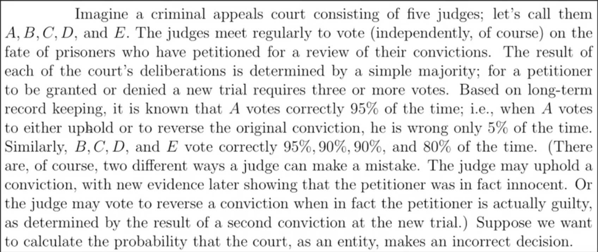

#### Load libraries
```{r}
library(ggplot2) # plotting library
library(dplyr)   # data wrangling library
```

#### Court decision problem


```{r}
s = c('correct', 'incorrect') # 1 correct decision, 0 incorrect decision

# Simulating the decision of judge-A once
sample(s, size = 1, prob = c(0.95, 0.05))

# Simulating the decision of judge-A 100,000 times
nsimulations = 1e5
simulatedData_A = sample(s, size = nsimulations, replace = TRUE, prob = c(0.95, 0.05))
simulatedData_B = sample(s, size = nsimulations, replace = TRUE, prob = c(0.95, 0.05))
simulatedData_C = sample(s, size = nsimulations, replace = TRUE, prob = c(0.9, 0.1))
#print(simulatedData)

# According to my simulated data, fraction of times judge-A would make a correct decision
mean(simulatedData_A == 'correct')
mean(simulatedData_B == 'correct')
mean(simulatedData_C == 'correct')
```

#### Simulated the 5 judges decision making using a modular code
```{r}
# Correct decision probabilities of all judges
judge_A_correct = 0.95 
judge_B_correct = 0.95
judge_C_correct = 0.9
judge_D_correct = 0.9
judge_E_correct = 0.8

# Matrix of decision probabilities of all judges
p = matrix(data = c(judge_A_correct, judge_B_correct, judge_C_correct, judge_D_correct, judge_E_correct, 1-judge_A_correct, 1-judge_B_correct, 1-judge_C_correct, 1-judge_D_correct, 1-judge_E_correct), nrow = 2, ncol = 5, byrow = TRUE)

# User-defined function to simulated the judges' decision making process once
courtResult = function(){
  result = character(ncol(p))
  for(j in c(1:ncol(p))){
    result[j] = sample(s, size = 1, replace = TRUE, prob = p[, j])
  }
  return(result)
}

# Simulate the judges' decision making process 100,000 times
nsimulations = 1e5
simulatedData = replicate(nsimulations, courtResult())

# User-defined function to check if the court decision is incorrect
checkEvent = function(data){
  return(sum(data == 'incorrect') >= (ncol(p)+1)/2)
}

# Probability that the court makes an incorrect decision
mean(apply(simulatedData, 2, checkEvent))
```

#### Simulated the 5 judges decision making using a modular code
```{r}
# Correct decision probabilities of all judges
judge_A_correct = 0.95 
judge_B_correct = 0.95
judge_C_correct = 0.9
judge_D_correct = 0.9
judge_E_correct = 0.8

# Matrix of decision probabilities of all judges
p = matrix(data = c(judge_A_correct, judge_B_correct, judge_C_correct, judge_D_correct, judge_E_correct, 1-judge_A_correct, 1-judge_B_correct, 1-judge_C_correct, 1-judge_D_correct, 1-judge_E_correct), nrow = 2, ncol = 5, byrow = TRUE)

# User-defined function to simulated the judges' decision making process once
courtResult = function(){
  result = character(ncol(p))
  for(j in c(1:ncol(p))){
    result[j] = sample(s, size = 1, replace = TRUE, prob = p[, j])
  }
  return(result)
}

# Simulate the judges' decision making process 100,000 times
nsimulations = 1e5
simulatedData = replicate(nsimulations, courtResult())

# User-defined function to check if the court decision is incorrect
checkEvent = function(data){
  return(sum(data == 'incorrect') >= (ncol(p)+1)/2)
}

# Probability that the court makes an incorrect decision
mean(apply(simulatedData, 2, checkEvent))
```


#### Simulated the 5 judges decision making using a modular code
```{r}
# Correct decision probabilities of all judges
judge_A_correct = 0.95 
judge_B_correct = 0.95
judge_C_correct = 0.9
judge_D_correct = 0.9
judge_E_correct = 0.8

# Matrix of decision probabilities of all judges
p = matrix(data = c(judge_A_correct, judge_B_correct, judge_C_correct, judge_D_correct, judge_E_correct, 1-judge_A_correct, 1-judge_B_correct, 1-judge_C_correct, 1-judge_D_correct, 1-judge_E_correct), nrow = 2, ncol = 5, byrow = TRUE)

# User-defined function to simulated the judges' decision making process once
courtResult = function(){
  result = character(ncol(p))
  for(j in c(1:ncol(p))){
    result[j] = sample(s, size = 1, replace = TRUE, prob = p[, j])
  }
  return(result)
}

# Simulate the judges' decision making process 100,000 times
nsimulations = 1e5
simulatedData = replicate(nsimulations, courtResult())

# User-defined function to check if the court decision is incorrect
checkEvent = function(data){
  return(sum(data == 'incorrect') >= (ncol(p)+1)/2)
}

# Probability that the court makes an incorrect decision
mean(apply(simulatedData, 2, checkEvent))
```

#### Simulated the 5 judges decision making when judge-E replicates what judge-A does
```{r}
# Correct decision probabilities of all judges
judge_A_correct = 0.95 
judge_B_correct = 0.95
judge_C_correct = 0.9
judge_D_correct = 0.9
judge_E_correct = 0.8

# Matrix of decision probabilities of all judges
p = matrix(data = c(judge_A_correct, judge_B_correct, judge_C_correct, judge_D_correct, judge_E_correct, 1-judge_A_correct, 1-judge_B_correct, 1-judge_C_correct, 1-judge_D_correct, 1-judge_E_correct), nrow = 2, ncol = 5, byrow = TRUE)

# User-defined function to simulated the judges' decision making process once
courtResult = function(){
  result = character(ncol(p))
  for(j in c(1:ncol(p))){
    result[j] = sample(s, size = 1, replace = TRUE, prob = p[, j])
  }
  result[5] = result[1]
  return(result)
}

# Simulate the judges' decision making process 100,000 times
nsimulations = 1e5
simulatedData = replicate(nsimulations, courtResult())

# User-defined function to check if the court decision is incorrect
checkEvent = function(data){
  return(sum(data == 'incorrect') >= (ncol(p)+1)/2)
}

# Probability that the court makes an incorrect decision
mean(apply(simulatedData, 2, checkEvent))
```